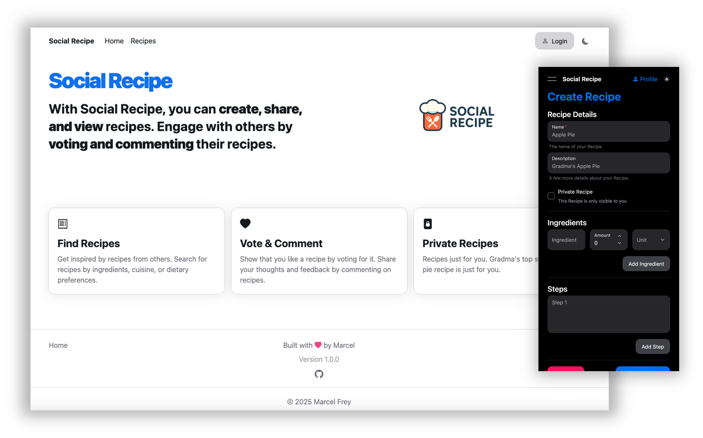

# IU-DOCC-Project-Secure-Software-Implementation

[](https://github.com/marcelfrey29/IU-DOCC-Project-Secure-Software-Implementation/actions/workflows/backend-ci.yml)
[](https://github.com/marcelfrey29/IU-DOCC-Project-Secure-Software-Implementation/actions/workflows/web-app-ci.yml)
[](https://github.com/marcelfrey29/IU-DOCC-Project-Secure-Software-Implementation/actions/workflows/kubernetes-ci.yaml)
[](https://github.com/marcelfrey29/IU-DOCC-Project-Secure-Software-Implementation/actions/workflows/terraform-ci.yml)

## Social Recipe Application

- [x] Application Development as **Security Champion** using **DevSecOps Principles**
    - [x] Single Page Web Application (**React, HeroUI, TypeScript**)
    - [x] Backend Service (**Hono, TypeORM, Zod, TypeScript**) and **PostgreSQL Database** 
    - [x] **Authentik** as Identity Provider for Login & Registration using OIDC/OAuth
    - [x] Deployment to **Kubernetes** and configuration via **Terraform**
- [x] **Threat Modelling** using **AWS Threat Composer** and creation of a **Data-Flow-Diagram (DFD)**
- [x] Securing the inital vulnerable application using **Best Practices and Recommendations** from the **OWASP Top 10** and **Common Weakness Enumeration (CWE)**
    - [x] **Detailed Documentation** as reference for other Engineers
    - [x] **Standardized Security Issue Documentation** by using GitHub Issue Templates
- [x] Definition and setup of **Vulnerability Detection & Prevention Strategies** and **Quality Assurance**
    - [x] Usage of Linting & Formatters (**Biome, Kube-Lint**)
    - [x] **Continuous Integration** with **GitHub Actions**
    - [x] **Static Application Security Testing (SAST)** using **Bearer CLI** and **Trivy**
    - [x] Automatic Dependency Updates via **Dependabot**



## Documentation

- [Concept](docs/01-Concept.md): Application Concept & Architecture
- [Development of the Vulnerable Application](docs/02-Initial-Application-Vulnerable.md)
- [List of Flaws/Weaknesses/Vulnerabilites](docs/03-Flaws.md): Issue, Category, Mappings (OWASP Top 10, CWE)
- [Implementation (Vulnerable Version)](docs/04-Implementation.md)
- [Threat Modelling](docs/05-Threat-Modelling.md): The full Threat Model can be found [here](threat-modelling/threat-model.md)
- [Vulnerability Detection & Prevention Strategies](docs/06-Security-Processes.md)
- [Implementation (Secure Version)](docs/07-Secure-Version.md)

## Prerequisites for Development

- A [Kubernetes](https://kubernetes.io/) Cluster (e.g. via Docker Desktop)
- [Helm](https://helm.sh/) 
- [Terraform](https://developer.hashicorp.com/terraform)
- [Node.js 22 (LTS)](https://nodejs.org/)
- (Optional) [AWS Toolkit for VS Code (for the AWS Threat Composer)](https://marketplace.visualstudio.com/items?itemName=AmazonWebServices.aws-toolkit-vscode)
- [Bearer CLI (SAST)](https://docs.bearer.com/)
- [Trivy (SAST)](https://trivy.dev/latest/)
- [Kube Linter](https://docs.kubelinter.io/#/)

## Deployment

- Create a copy of the `.env.TEMPLATE` file and name it `.env`
- Add values for the keys in the `.env` file
    - `AUTHENTIK_PG_PASS`: Password for the Authentik PostgreSQL Database (run `openssl rand -base64 36` to generate a value)
    - `AUTHENTIK_SECRET_KEY`: Secret Key for Authentik (run `openssl rand -base64 60` to generate a value)
    - `SOCIAL_RECIPE_DB_USER`: Any valid PostgreSQL username (e.g. `social-recipe-db-rw-user`)
    - `SOCIAL_RECIPE_DB_PASSWORD`: Password for the Social Recipe Backend PostgreSQL Database (run `openssl rand -base64 36` to generate a value)
- Deploy the Application into Kubernetes
    - `cd kubernetes`
    - `./deploy.sh`
- Open the Authentik Setup Page: http://auth-service.localhost/if/flow/initial-setup/ (_This can take a moment because the application needs to be deployed and started. "Connection Reset", 404 and 503 errors are expected. Refresh your browser until you see the Authentic Page._)
    - _The default username is `akadmin`_ (not needed here, just as a reference)
    - Fill out the form (add any valid email e.g. `akadmin@example.com` and select a password for the default user)
    - Click "Continue" (_You should now see the Authentik Dashboard_)
- Setup Authentik (Auth Service)
    - Open http://auth-service.localhost/ and log-in as admin user (`akadmin`)
    - Go to "Settings" (Gear in the upper right) -> "Tokens and App Passwords"
    - Click "Create Token", add `terraform` as `identifier` and click create
        - Use this token in commands below, as described
    - Terraform can't resolve `auth-service.localhost` without a host entry, so we need to create one
        - Edit the `/etc/hosts` file and add the following line: `127.0.0.1    auth-service.localhost`
    - Run `terraform init` and `AUTHENTIK_TOKEN=<token> terraform apply`, confirm with `yes`
- _The setup is now complete_ 🥳

## Local Development

The PostgreSQL Database is running in Kubernetes and is not publicly available. 
For local development (e.g. when running `npm run dev` in the `backend/` directory), the K8s service needs to be forwarded to `localhost:5432`.

```bash
# Backend
cd backend
DB_USERNAME="social-recipe-db-rw-user" DB_PASSWORD="<pw>" npm run dev

# Web App
cd web-app
npm run dev

# Make PostgreSQL available
kubectl port-forward -n social-recipe svc/postgres 5432:5432 
```

#### Reset the PostgreSQL Database

```bash
# Stop the Database by scaling to zero
kubectl scale statefulset postgres --replicas=0 -n social-recipe

# Delete the PVC
kubectl delete pvc postgres -n social-recipe

# Delete the PV
kubectl delete pv postgres --grace-period=0 --force

# In the `postgres.pv.yaml` file, change the `path` of the `hostPath`.
# Background: 
# In Docker Desktop we can't easily clean the local directories, so we just create
# a new one. Without this, the new PV will provide the already stored database to 
# the PostgreSQL container which means no no database will be created.

# Redeploy the application
# All containers of the web app and backend will be restarted so that the newst "latest"
# image is used.
./deploy.sh
```

#### Access PostgreSQL Database via CLI

```bash
# Connect to PostgreSQL Container
kubectl exec postgres-0 -n social-recipe -it -- /bin/bash

# Run PSQL
psql --username=social-recipe-db-rw-user socialrecipe
```

#### Security Testing

```bash
# SAST - Backend
bearer scan --fail-on-severity medium --scanner secrets,sast backend
trivy image --scanners vuln,secret,misconfig --pkg-types os,library --severity CRITICAL,HIGH ghcr.io/marcelfrey29/iu-docc-secure-software-development-backend:latest
trivy fs --scanners vuln,secret,misconfig --severity CRITICAL,HIGH backend

# SAST - Web App
bearer scan --fail-on-severity medium --scanner secrets,sast web-app
trivy image --scanners vuln,secret,misconfig --pkg-types os,library --severity CRITICAL,HIGH ghcr.io/marcelfrey29/iu-docc-secure-software-development-web-app:latest
trivy fs --scanners vuln,secret,misconfig --severity CRITICAL,HIGH web-app

# SAST - Kubernetes
trivy fs --scanners vuln,secret,misconfig --severity CRITICAL,HIGH kubernetes

# SAST - Terraform
trivy fs --scanners vuln,secret,misconfig --severity CRITICAL,HIGH terraform
```
